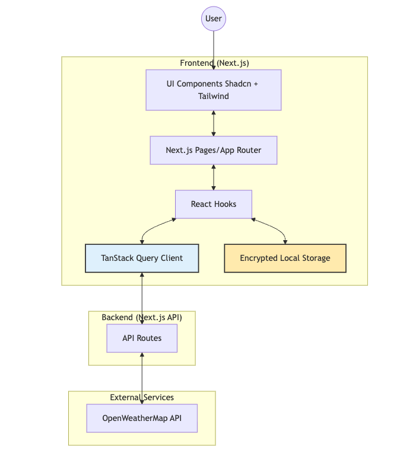
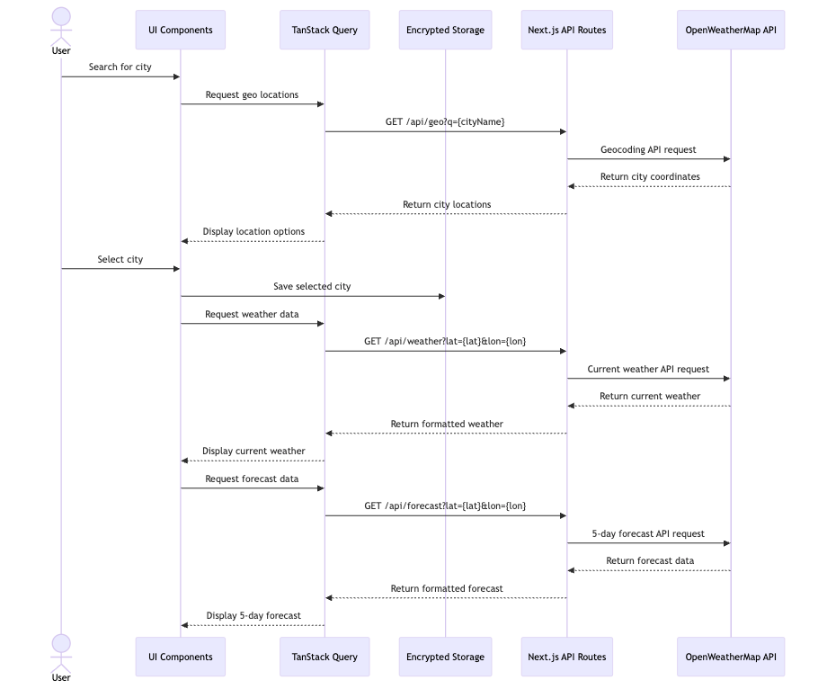
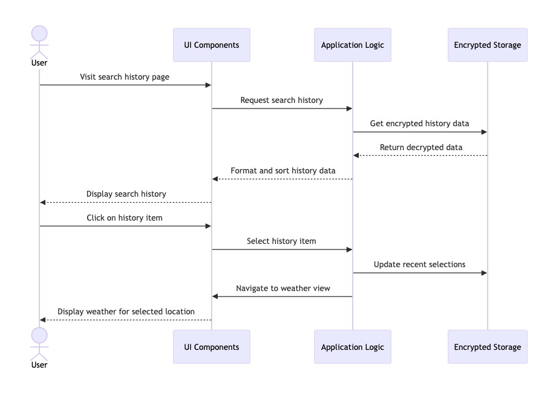

# Tech ecosystem

The [GETTING_STARTED.md](./GETTING_STARTED.md) gives you adequate information on
how to install dependencies and launch the app. This document is intended to
give you a taste of how the app works and why we chose certain technologies. It
assumes basic knowledge of React and
[Next.js](https://nextjs.org/docs/getting-started).

## Tech stack

### Core

- [x] [React](https://reactjs.org/)
- [x] [TypeScript](https://www.typescriptlang.org)
- [x] [Next.js](https://nextjs.org/) for server-side rendering and routing
- [x] [TanStack Query](https://tanstack.com/query/latest) for data fetching

### UI & styling

- [x] [Tailwind CSS](https://tailwindcss.com/) for styling
- [x] [Shadcn UI](https://ui.shadcn.com/) for UI components

### Static type checking & linting

- [x] [TypeScript](https://www.typescriptlang.org)
- [x] [ESLint](http://eslint.org/)
- [x] [Prettier](https://prettier.io/)
- [x] [Husky](https://typicode.github.io/husky/) for Git hooks
- [x] [lint-staged](https://github.com/okonet/lint-staged) for running linters on staged files

## Architecture

The app is built with React and Next.js. Here's a high-level overview:

1. **Frontend**: React with Next.js App Router for routing and rendering.
2. **State Management**: Combination of local storage for persistent state and TanStack Query for server state management.
3. **UI**: Shadcn UI with Tailwind CSS for UI components.
4. **API**:
   - Next.js API routes to secure the OpenWeatherMap API key
   - [OpenWeatherMap API](https://openweathermap.org/api) for weather data

    

## Sequence Diagrams

## Linting and Formatting

This repo uses [ESLint](http://eslint.org/) and [Prettier](https://prettier.io/)
for code quality and formatting. We recommend installing the relevant IDE
extensions for these tools.

A git hook is set up using Husky to automatically analyze and fix linting errors before code
is committed via lint-staged. You can modify this behavior in the `lint-staged` section of
`package.json`.

## Read on:

- [Getting started](./GETTING_STARTED.md)
- [Editor](./EDITOR.md)
- [Deployment](./DEPLOYMENT.md)
